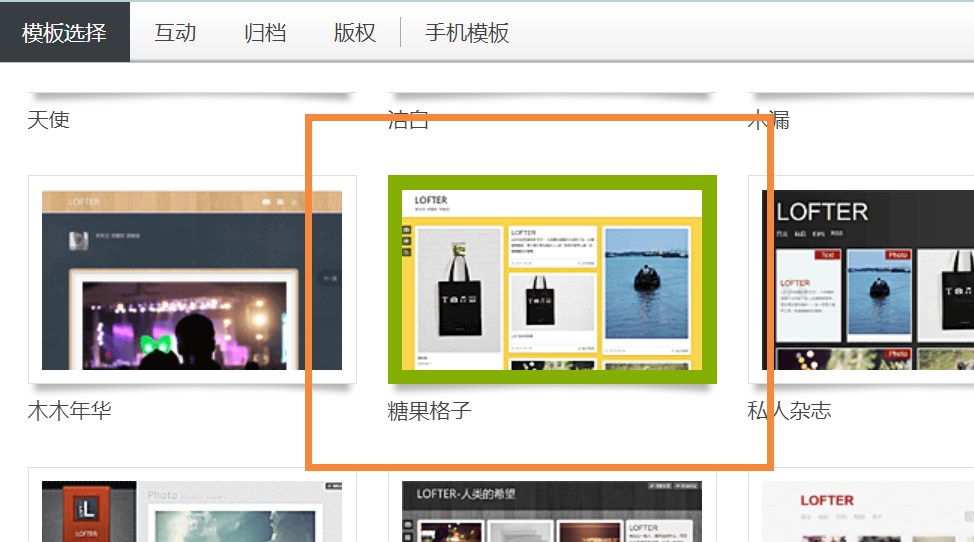
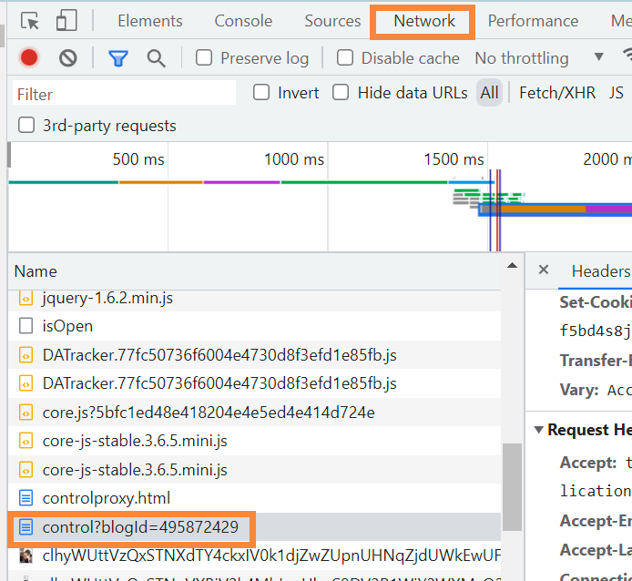
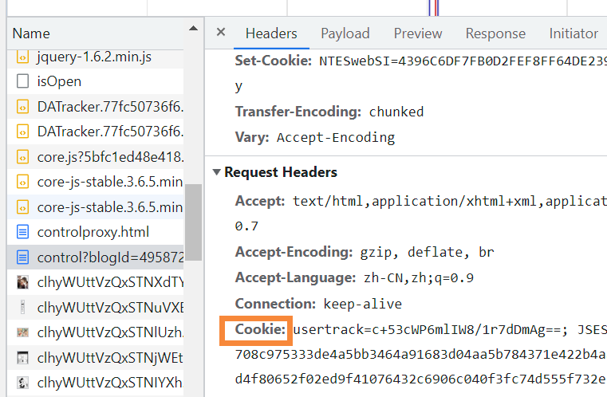
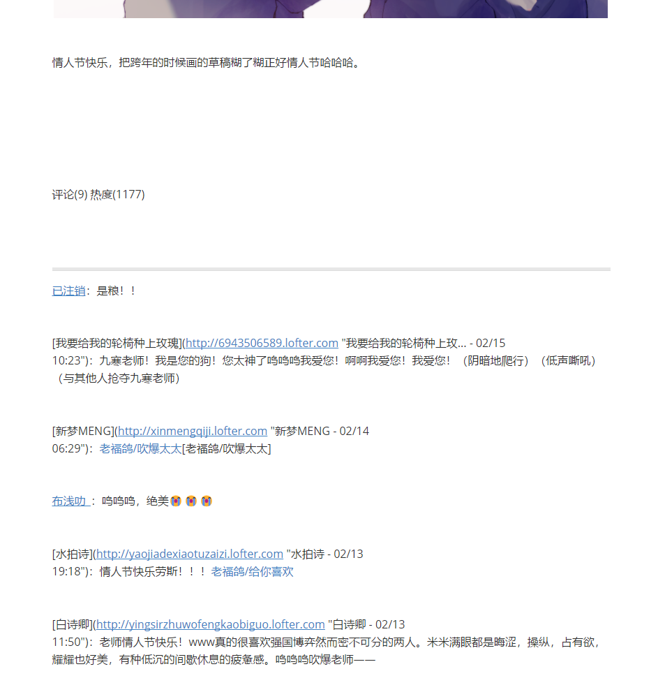

# LOFTER-Personal-Homepage-Backup-Tool
LOFTER个人主页备份工具
# README

### Feature

​	本程序可以获取LOFTER个人主页界面所有文章链接，包括仅自己可见的文章（需要登录）。

​	可以将文章基本信息、内容、评论保存为html以及markdown两种文件形式。

​	请注意本程序并未下载网页上的任何图片，链接皆为网页形式，有需要可自行使用其他软件或插件将链接下载并替换为本地形式。

### Environment

python 3.9

Chrome

### Requirements

requests==2.28.1

beautifulsoup4==4.11.1

html2text==2020.1.16

selenium==4.8.2

### 使用帮助

#### 高亮注意：

​	此程序是根据本人使用的LOFTER主题写的，如果和本人主题不一致有可能会失败！为了确保格式一致请在开始前登录自己的主页将模板设置为“糖果格子”。

#### 登录模式：

- **首先请获取用于requests的cookie，具体步骤**：打开浏览器，登录LOFTER，进入“你的用户名.lofter.com”，按F12，进入Network选项卡，找到Name列下control?blogId=一串数字，看右侧Headers下-Request Headers-Cookie，复制usertrack开始的一整串字符。

  请小心，必须全部复制且不能有错，检查前后空格。如果Network下是空白刷新一下就好了。

  

- LOFTER ID是 .lofter.com前面的那串字符
- 没有Chrome的可以在这里下载：https://chromedriver.chromium.org/downloads
- 全程只需要运行main.py程序，开始后根据运行框内提示输入即可，输入完按回车，文件会保存在程序同目录下
- 运行程序选择登录模式后会弹出LOFTER登录界面，请在20秒内登录完成
- 本人由于网络问题所以将tool.py中个别函数的等待时间调得较长，如果有需要可以自行修改等待时间。注意：评论区的浏览器窗口的等待加载时间必须足以使评论全部显示出来，如果没有显示完整最后评论信息会有缺失。

### 效果

#### HTML文件

#### Markdown文件

### 其他

​	此程序是本人得知LOFTER的神仙操作后，凭借对他们的恨意一天速成自学爬虫写的，主要是为了我个人备份小伙伴们宝贵的评论，所以程序上有很多不足，生成出来的文件也可能不是很精美，请多多包含。大佬们请根据自己的需要随意修改我的代码！

#### 最后，老坟头你欠我的拿什么还！！！
